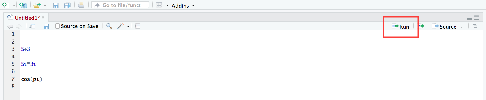

```{r setup, include=FALSE}
knitr::opts_chunk$set(collapse = FALSE)
library(tidyverse)
library(ggplot2)
library(knitr)
library(kableExtra)
library(extraDistr)
library(gridExtra)
library(latex2exp)
library(moments)
library(bookdown)
library(rsconnect)
```

\newcommand{\E}{\text{E}}
\newcommand{\Var}{\text{Var}}
\newcommand{\SD}{\text{SD}}
\newcommand{\SE}{\text{SE}}
\newcommand{\Cov}{\text{Cov}}
\newcommand{\Cor}{\text{Cor}}
\renewcommand{\P}{\text{P}}
\newcommand{\pd}[2]{\frac{\partial #1}{\partial #2}}
\newcommand{\sumin}{\sum_i^n}
\newcommand{\Bias}{\text{Bias}}

---

# Installing R and RStudio 

R is a programming language for statistical computing. To use R on your computer, you will need to install both R and RStudio.  

* to install R, go to CRAN -- https://cloud.r-project.org/ -- and click the link for your OS. On the Mac download page, choose the version under 'Latest Release'. On the Windows download page, choose the 'base' subdirectory, then click download at the top.    
* to install RStudio go here -- https://www.rstudio.com/download -- and choose the free open source licence.  


\ 

---

# RStudio 

RStudio is an IDE (integrated development environment). It is an interface you can use to write and debug R code. Any time you want to do work using R, open RStudio.  

When you first open RStudio you will see three panes:  

```{r, echo=FALSE}

```

The left-hand pane is the **console** -- this is where R evaluates code. Type a command (e.g. 5 + 3) in the console and press enter. You should see the output in the following line.  

The two right-hand panes show extra information about your R session -- you will come to learn what they do as you code.    


\ 

---

# Writing R Code

Commands you type in the console will not be not saved -- the console only evaluates code. To save your code, you must write it in a script file.  

To open a new R script file click the icon in the top left and choose R Script, as follows: 

```{r, echo=FALSE}

```

The script editor will open as a new pane in the top left. Anything you write here can be run in the console, and when you are done, you can save it as a .R file.  

To run code you have written in the script editor, click 'Run' (top right). The current line (or the selected lines) will be run in the console.  

```{r, echo=FALSE} 

```

\ 

## Variable assignment

You can create objects using the assignment operator, `<-`. This evaluates the expression on its right hand side and assigns the result to the object name on its left. E.g.

```{r}
x <- 5
```

Technically you can use either `<-` or `=` for variable assignment. Both do the same thing when used for assignment, though in general there is a subtle difference between the two.  

You can create a **vector** -- a one-dimensional array of elements -- by writing `c()`, and using commas to separate the elements:

```{r}
some_numbers <- c(4,5,6,7,8)
```

The objects you have defined in a session will appear in the Environment pane (top right). You can call an object by simply typing its name. The elements of the object will appear in the console: 

```{r}
some_numbers
```

\ 

## Comments

Comments are denoted by hashes. Anything written after a hash symbol will not be evaluated by the console. It is good practice to comment your code, i.e. describe what it is doing.  

```{r}
# create vector of integers from 0 to 9
digits <- c(0:9) 
```

Note the **colon operator**, `:`, which generates a sequence of integer numbers in the range specified.  

```{r}
digits
```


\ 

## R functions

Just like mathematical functions, R functions perform operations on objects. R has many inbuilt functions -- e.g. the `mean()` function which takes a vector array of numbers and returns its average value:  

```{r}
mean(digits)
```

What you type in the brackets is the function's **argument** -- this is the input you are giving to the function. Most functions accept several arguments, some of which are mandatory while others are optional. Usually the first argument is for specifying the object (what the function is operating on), and additional arguments are for specifying how you want the function to operate. If you leave optional arguments blank when calling a function, it will operate according to its default settings. 

To learn about the arguments and default settings of a function, you should look up its documentation. You can do this by typing the function's name in the 'Help' tab (bottom right pane). E.g. for the `mean()` function: 

```{r, echo=FALSE}

```


\ 

--- 

# R Markdown

R Markdown is a format for creating unified documents with R. Unlike the plain script format, R Markdown allows you to combine code, its output, and text annotations in a single document.  

To open a new R Markdown file, click on the top left icon and choose R Markdown. You will see the following options menu:

```{r, echo=FALSE}

```

Enter a name and title for your document (these can be changed later). You can choose whichever output format you wish, but note that for pdf output you will need to have TeX installed on your computer. For simplicity you should use html output.   

After choosing your output format you will be greeted by some sample Markdown script, as follows: 

```{r, echo=FALSE}

```

The grey boxes are **code chunks**. Only stuff written in the code chunks will be treated as code and evaluated in the console. Everything outside the code chunks will appear as text in your output document. To insert a new code chunk, click on Code > Insert Chunk (from the menu bar).  

Now go ahead and compile the document (i.e. create the output file) by clicking 'Knit'. You will need to have saved the file first. A separate window will open with the output file -- you should compare this to the script file and make note of how R Markdown translates from script to its output format.  

```{r, echo=FALSE}

```

You should experiment with R Markdown and get used to its syntax. Here is an R Markdown cheatsheet (`insert link`) to get started.  

