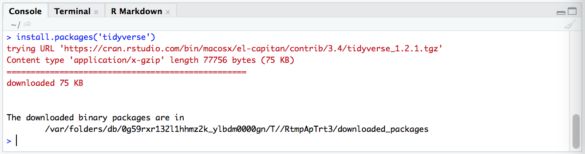
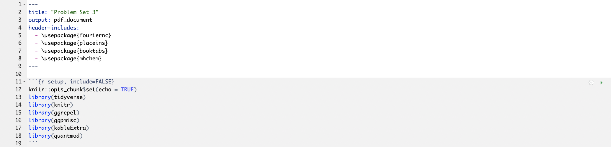

```{r setup, include=FALSE}
knitr::opts_chunk$set(collapse = FALSE)
library(tidyverse)
library(ggplot2)
library(knitr)
library(kableExtra)
library(extraDistr)
library(gridExtra)
library(latex2exp)
library(moments)
library(bookdown)
library(rsconnect)
```

\newcommand{\E}{\text{E}}
\newcommand{\Var}{\text{Var}}
\newcommand{\SD}{\text{SD}}
\newcommand{\SE}{\text{SE}}
\newcommand{\Cov}{\text{Cov}}
\newcommand{\Cor}{\text{Cor}}
\renewcommand{\P}{\text{P}}
\newcommand{\pd}[2]{\frac{\partial #1}{\partial #2}}
\newcommand{\sumin}{\sum_i^n}
\newcommand{\Bias}{\text{Bias}}

---

# R Packages

Packages are bundles of R functions. Some common R packages you will encounter:

* `ggplot2` - has functions for plotting data
* `dplyr` - has functions for cleaning/manipulating data 
* `stats` - has functions for statistical calculations and random number generation  

The **tidyverse** is a set of eight common R packages used in data analysis. It includes `ggplot2` and `dplyr`. When you start out in R, loading the tidyverse packages is a good idea.  

\ 

## Installing packages

To use a package for the first time, you need to install it. Do this in the console with the command `install.packages()`. E.g. to install the tidyverse packages:

```{r, echo=FALSE}

```

Note the quotation marks around the package name.   

\ 

## Loading packages in an R session

Once a package is installed you needn't install it again. But to access the package in a session, you must load it using `library()`. You will need to do this every time you enter a new R session.  

```{r}
library(tidyverse)
```

If you run this code and get the error message "there is no package called 'tidyverse'", you need to first install it, then run `library()` again.  

It is common practice to load packages at the beginning of your script file. E.g. in an R Markdown file, you should load the relevant packages in the setup chunk (the first code chunk):  

```{r, echo=FALSE}

```

This will save you the hassle of remembering which packages you used and retyping them each time you enter a new session.  


\ 

--- 

# Loading Data

R has several inbuilt functions for loading data of various formats: 

* `read.csv()` for csv files (comma separated values) 
* `read.tsv()` for tsv files (tab separated values) 
* `read.xlsx()` for Excel files (from the `readxl` package)
* `read.dta13()` for dat files (from the `readstata13` package)
* `read.table()` for huge datasets

When loading data you must specify the exact file path in the argument (see below). If you don't know how to find your file path, give it a google. Remember to name your dataset (i.e. assign your dataset to an R object)

The following code loads a csv file with data on the gender pay gap at various UK firms. Source: https://gender-pay-gap.service.gov.uk/. Locally the file is called 'gender-paygap-2019.csv' and it is assigned to the object name `paygap`:  

```{r}
paygap <- read.csv('./data/gender-paygap-2019.csv', header = TRUE)
```

Note the extra argument, `header = TRUE`, which specifies that the first row of the dataset is a header. If your dataset has no header you should specify `header = FALSE`. Here the `=` operator is not used for variable assignment, but rather to specify an argument for the `read.csv()` function (this is the fundamental difference between the `<-` and `=` operators).  

\ 

## Viewing data 

To view the entire dataset, use the `View()` command in the console. A table view of the dataset will open as a new tab. For large datasets it is not a good idea to use the `View()` command as it is very memory intensive.  

Another way to see your data is to print the first or last few rows using the `head()` or `tail()` function. You can specify exactly how many rows as an additional argument (by default it will print six):  

```{r, class.output = 'scroll'}
head(paygap, n = 5)
```

To check the column names of your dataset, use `colnames()`:

```{r}
colnames(paygap)
```

To check the dimensions of your dataset (number of rows and columns), use `dim()`:

```{r}
dim(paygap)
```

\ 


--- 

# Basic Data Structures

A **variable** refers to something that is measured. In the pay gap data each column contains data pertaining to a specific variable (employer name, employer size, etc). Data can be continuous, discrete, or categorical.   

**Continuous data** can take an infinitely many values (real numbers).  

**Discrete data** can take on countable values only (integer numbers).  

**Categorical data** fall into a finite number of categories or distinct groups.  

\ 

## Data types in R

Every object in R has a **data type**. Below are the five elementary data types in R: 

* __character__ -- e.g. `'abcd'`
* __integer__ -- integer numbers, e.g. `'2'`
* __numeric__ -- decimal numbers, e.g. `'2.21'` 
* __complex__ -- complex numbers, e.g. `'2+2i'`
* __logical__ -- either `TRUE` or `FALSE`  

Objects may be combined to form larger data structures. Some common ones:  

* __vector__ -- a one-dimensional array; there are two kinds of vectors:
    + __atomic vector__ -- holds data of a single data type
    + __list__ -- holds data of multiple data types
* __matrix__ -- a two-dimensional array; all columns have the same data type
* __data frame__ -- a two-dimensional array; columns may have different data types  

You can check an object's data type using `class()`:

```{r}
class(paygap)
```

The data frame is indeed a common structure for tabular data. To check the data type(s) in the column `DiffMeanHourlyPercent`:

```{r}
class(paygap$DiffMeanHourlyPercent)
```

Note the **extract operator**, `$`, which is used to extract a named element from an object (in this case extract a column from a data frame).  
