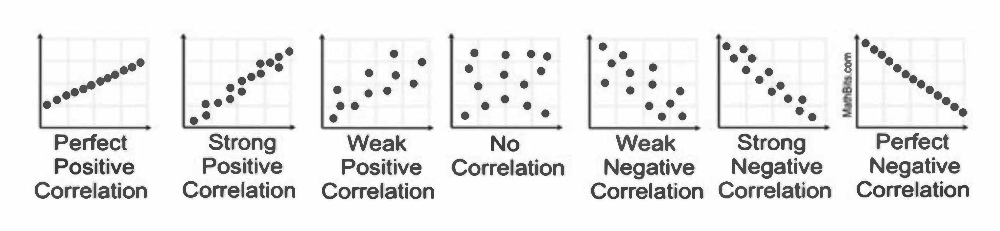

```{r setup, include=FALSE}
knitr::opts_chunk$set(collapse = FALSE)
library(tidyverse)
library(ggplot2)
library(knitr)
library(kableExtra)
library(extraDistr)
library(gridExtra)
library(latex2exp)
library(moments)
library(bookdown)
library(rsconnect)
```

```{r, include=FALSE}
paygap <- read.csv('./data/gender-paygap-2018.csv')
paygap <- paygap %>%
  mutate(EmployerSize = factor(EmployerSize, levels = c('0-249','250-499','500-999','1000-4999','5000-19999','20000+')))
nycheat <- read.csv('./data/nyc-heatwave.csv')
```

\newcommand{\E}{\text{E}}
\newcommand{\Var}{\text{Var}}
\newcommand{\SD}{\text{SD}}
\newcommand{\SE}{\text{SE}}
\newcommand{\Cov}{\text{Cov}}
\newcommand{\Cor}{\text{Cor}}
\renewcommand{\P}{\text{P}}
\newcommand{\pd}[2]{\frac{\partial #1}{\partial #2}}
\newcommand{\sumin}{\sum_i^n}
\newcommand{\Bias}{\text{Bias}}

---

# The Distribution of Data

A sample of data is a set of observations or measurements of a variable. As you saw in the previous chapter, histograms are a good way to visualize the **distribution** of observations in a variable.  

The following dataset has data on the gender pay gap at over 10,000 UK firms in 2018.^[The data is freely available at https://gender-pay-gap.service.gov.uk/. Excuse the horribly cumbersome variable names.]

Below is a preview of the dataset and some of the variables contained therein:

```{r, echo=FALSE}
kable(paygap[c(323,343,521,1387,1389,1495,3313,3889,4884,6214,7294,7299,10029), c(1:3,7:10)])
```

Below is a histogram of the variable `PropFemaleTopQuartile` -- the proportion of females in the top-earning quartile. 

```{r}
ggplot(aes(x = PropFemaleTopQuartile), data = paygap) + 
  geom_histogram(bins = 50, aes(y = ..density..)) +
  xlab('proportion of females in top-earning quartile') +
  theme_bw()
```

**Summary statistics** can help extract meaning from a distribution of data. The `summary()` function produces a few common ones: 

```{r}
summary(paygap$PropFemaleTopQuartile)
```

\ 

## Measures of central tendency

Measures of central tendency indicate the central or typical value of a distribution. The most common is the mean, though others are useful in certain situations.   

\ 

**Mean**

The mean of a set of observations is the sum of all observations divided by the number of observations. If data is a sample^[A sample is a subset of data from a population. Most experiments are conducted with samples.], this statistic is known as the **sample mean**:

$$\bar X = \frac 1n \sum_i^n X_i$$

where $X_i$ is an individual observation in the set, and $n$ is the number of observations.  

In R you can use `mean()`:

```{r}
mean(paygap$PropFemaleTopQuartile)
```

\ 

**Median**

The median is the middle value or the 50th percentile of a distribution. Half the observations are below (and above) the median: 

$$m = \frac 12 \big( X_{(n/2)} + X_{(n/2+1)} \big) \hspace{0.5cm} \text{or} \hspace{0.5cm} X_{(n+1)/2)}$$

In R you can use `median()`: 

```{r}
median(paygap$PropFemaleTopQuartile)
```

\ 

**Mode**

```{r, echo=FALSE, fig.margin = TRUE, fig.cap = "The mode can be visualized as follows."}
ggplot(aes(x = PropFemaleTopQuartile), data = paygap) + 
  geom_histogram(bins = 50, aes(y = ..density..)) +
  xlab('proportion of females in top-earning quartile') +
  geom_vline(xintercept = 0.102, linetype = 'dashed', color = 'violet') + 
  annotate('text', x = 0.17, y = 2, label = 'Mode', color = 'violet', size=5) + 
  theme_bw()
```

The mode is the most commonly occurring value. Although there is no function in R to formally calculate the mode, you can visualize it as the value corresponding to the peak in a histogram or density plot. 


\ 

## Measures of dispersion 

Measures of dispersion indicate the spread or variation of a distribution. The most common is the standard deviation. 

\ 

**Standard Deviation**

The standard deviation of a set of observations is the average distance of each observation from the mean. Again, if data is a sample, this statistic is known as the **sample standard deviation**:^[Note the denominator in the formula is $n-1$, not $n$. This is known as Bessel's correction, and is used when calculating the standard deviation of a **sample** of data. More on this later.]

$$s = \sqrt{\frac{1}{n-1} \sum_i^n (X_i - \bar X)^2}$$

In R you can use `sd()`:^[Note the `sd()` function in R computes the sample standard deviation, i.e. it uses the $n-1$ denominator.] 

```{r}
sd(paygap$PropFemaleTopQuartile)
```

The formula for standard deviation is derived from **variance**--the average squared distance of each observation from the mean:

$$s^2 = \frac{1}{n-1} \sum_i^n (X_i - \bar X)^2$$

\ 

**Quartiles**

The **lower quartile** is the 25th percentile of the distribution (one quarter of the observations are below it). 

The **upper quartile** is the 75th percentile of the distribution (one quarter of the observations are above it). 

\ 

## Skew

In a perfectly symmetric distribution, the mean, median, and mode are equal. Disparities indicate the distribution is skewed.  

Compare the distributions for females and males in the top-earning quartile:  

```{r, echo=FALSE, fig.width=10, fig.height=5}
plot1 <- ggplot(aes(x = PropFemaleTopQuartile), data = paygap) + 
  geom_histogram(bins = 50, aes(y = stat(density))) +
  xlab('proportion of females in the top-earning quartile') + 
  geom_vline(xintercept = mean(paygap$PropFemaleTopQuartile), linetype = 'dashed', color = 'red') +
  annotate('text', x = 0.47, y = 2, label = 'Mean', color = 'red') + 
  geom_vline(xintercept = median(paygap$PropFemaleTopQuartile), linetype = 'dashed', color = 'blue') + 
  annotate('text', x = 0.30, y = 2, label = 'Median', color = 'blue') + 
  geom_vline(xintercept = 0.105, linetype = 'dashed', color = 'violet') + 
  annotate('text', x = 0.17, y = 2, label = 'Mode', color = 'violet') + 
  theme_bw()

plot2 <- ggplot(aes(x = PropMaleTopQuartile), data = paygap) + 
  geom_histogram(bins = 50, aes(y = stat(density))) +
  xlab('proportion of males in the top-earning quartile') + 
  geom_vline(xintercept = mean(paygap$PropMaleTopQuartile), linetype = 'dashed', color = 'red') +
  annotate('text', x = 0.51, y = 2, label = 'Mean', color = 'red') + 
  geom_vline(xintercept = median(paygap$PropMaleTopQuartile), linetype = 'dashed', color = 'blue') + 
  annotate('text', x = 0.71, y = 2, label = 'Median', color = 'blue') + 
  geom_vline(xintercept = 0.90, linetype = 'dashed', color = 'violet') + 
  annotate('text', x = 0.83, y = 2, label = 'Mode', color = 'violet') + 
  theme_bw()

grid.arrange(plot1, plot2, ncol = 2)
```

Naturally^[Due to the cis-normativity of the study.] the distributions for females and males are mirror images of each other. 

The distribution for females has **right-skew** (or positive skew), since the tail drags rightwards (in the positive direction). The distribution for males has **left-skew** (negative skew), since the tail drags leftwards (in the negative direction).  

- under right skew, mean $>$ median $>$ mode
- under left skew, mode $>$ median $>$ mean

Formally, the **skewness** of a sample of data is defined as: 

$$g_1 = \frac{\frac 1n \sum_i^n (X_i - \bar X)^3}{s^3}$$

In R you can use `skewness()`:^[From the `moments` package.]

```{r}
skewness(paygap$PropFemaleTopQuartile)
```

The positive value indicates the distribution for females is positively skewed. Predictably, the skewness of the distribution for males is:

```{r}
skewness(paygap$PropMaleTopQuartile)
```


\ 

## Outliers 

Outliers are data points that differ substantially from other observations. The presence of outliers in a sample indicates either:

1. there is measurement error in the experiment
2. the population has a skewed/heavy-tailed distribution  

Outliers due to measurement error should be discarded as they unduly skew results. Below is an example from a classic dataset measuring the speed of light in 1879:  

```{r, echo=FALSE}
library(datasets)

ggplot(aes(x = as.factor(Expt), y = Speed + 299000), data = morley) + 
  geom_boxplot() +
  ggtitle('Michelson-Morley Experimental Data 1879') + 
  xlab('experiment no.') + ylab('speed of light (km/s)') +
  theme_bw()
```

Boxplots are a good way to visualize outliers in a distribution of data. In this example, experiments 1 and 3 have outliers.  

If outliers are not due to measurement error, they may suggest the distribution is intrinsically **skewed** or **heavy-tailed**. An example is the distribution of females/males in the top-earning quartile. Provided the observations are not erroneous, the skew of these distributions may reflect the inherent asymmetry in the distribution of females/males across income.^[Assuming, of course, that the data is **unbiased**; this is a big assumption that ought to be tested before any such conclusions are drawn. See: bias. `insert link`]  

In general, outliers should not be discarded unless they are obviously due to measurement error.  

\ 

**Mean vs. Median**

In the presence of outliers, the mean is more susceptible to skew than the median. This is because the mean is weighted by each observation in a sample. The median is not--it is simply the middle value.  

E.g. in the following sample, nine observations are between 21 and 22, and one outlier is above 80:

```{r, echo=FALSE}
X <- c(round(runif(n = 9, min = 21, max = 22),1), 83.4)
kable(t(X))
```

The mean of this sample is $\bar X =$ `r toString(round(mean(X), 2))` and the median is $m =$ `r toString(round(median(X), 2))`. Clearly the median is a more representative measure of central tendency than the mean.  

Strong outliers drag the mean in the direction of skew (in this case positive). This is why under positive skew the mean is larger than the median, and vice versa.  

Estimators are said to be **robust** if they can cope with outliers. The median is a robust measure of central tendency; the mean is not. However the mean is generally a more precise statistic.   

\ 

**Median Absolute Deviation (MAD)**

The median absolute deviation is a robust measure of dispersion. Mathematically it is defined as the median of the absolute deviations of each observation from the data's median: 

$$\text{MAD} = \text{median}(|X_i - m|)$$

where $m$ is the median of the data.  

The MAD is more resilient to outliers than the standard deviation is, since the former uses absolute deviations, while the latter usessquared deviations.  

In R, you can use `mad()`:^[From the `stats` package.] 

```{r}
mad(paygap$PropFemaleTopQuartile)
```


\ 

--- 

# Point and Interval Estimators 

```{r, include=FALSE}

```

Summary statistics derived from samples of data--such as the sample mean and sample standard deviation--are known as **estimators**, since they use samples to estimate the true values of underlying population parameters.^[E.g. the *true* mean difference in hourly wages between women and men is unknown; but the sample of pay gap data can be used to estimate it.] 

The summary statistics introduced above are known as **point estimators** since they are single-valued estimates.  

There also exist **interval estimators**, which provide a range of values for what the true underlying parameter could be. Often these are more useful than single-valued estimates, as they provide reasonable margins of error when drawing conclusions from data. A **confidence interval** is one example of an interval estimator.  


\ 

## Confidence intervals (needs work)

A confidence interval for a parameter is a range of values that might contain the true parameter. Every confidence interval is associated with a **confidence level**, which describes the approximate probability the true parameter lies in the interval specified.^[The theory behind this is explained in part 2.]  

E.g. say you are trying to determine the mean difference in hourly wages between women and men. Rather than using the sample mean of `DiffMeanHourlyPercent` as your estimate, you could calculate a 95\% confidence interval for the mean, which is a range of values with an approximately^[This is a major source of misunderstanding. Since confidence intervals are computed from samples of data, no interval can be *exactly* 95\% confident about containing the true parameter. The confidence level is only approximate, and should only be used as a guide.] 95\% probability of containing the true mean:

$$\P(LB \leq \bar X \leq UB) \approx 0.95$$

where $\bar X$ is the sample mean, and $LB$ and $UB$ are the lower and upper bounds of the interval. 

Although there is no function in R to formally compute a confidence interval for a parameter, below is one I have written that does the job.^[For more on writing functions in R, click <a href="https://www.statmethods.net/management/userfunctions.html">here.</a>] The function, `confidence_interval()`, takes a vector array of data and computes a confidence interval for the mean. The function takes two inputs: `data`: a vector array of data, and `conflevel`: the desired confidence level.  

```{r}
confidence_interval <- function(data, conflevel) {
  xbar <- mean(data)          # sample mean 
  n <- length(data)           # sample size 
  SE <- sd(data) / sqrt(n)    # standard error
  alpha <- 1 - conflevel      # alpha
  
  lb <- xbar + qt(alpha/2, df = n-1) * SE    # calculate lower bound
  ub <- xbar + qt(1-alpha/2, df = n-1) * SE  # calculate upper bound
  
  cat(paste(c('sample mean =', round(xbar,3), '\n', 
              conflevel*100, '% confidence interval:', '\n', 
              'lower bound =', round(lb,3), '\n', 
              'upper bound =', round(ub,3))))
}
```

You can use this function to compute a 95\% confidence interval for the mean difference in hourly wages between women and men:

```{r}
confidence_interval(data = paygap$DiffMeanHourlyPercent, conflevel = 0.95)
```

The interval implies there is an approximately 95\% chance the true mean difference in hourly wages is between 13.93\% and 14.47\%. 


\ 

--- 

# Simple Hypothesis Tests

A **hypothesis** is simply an assumption about a population characteristic--it is essentially a model for what a population looks like. A hypothesis can be based on a sample of data or even a hunch.^[However, it is generally discouraged to have statistically unfounded hunches about things.]. But if some new data about the population emerges, and it suggests a different conclusion to the one hypothesized, there may be grounds to reject the initial hypothesis. 

A **hypothesis test** is essentially a comparison between a sample of data and a presupposed model for what the population looks like. The test is used to either validate or reject the model. 

Formally there are two hypotheses in a test: 

- **the null hypothesis**, $H_0$, a proposed model for a population 
- **the alternative hypothesis**, $H_1$, that the proposed model is not true 

The test is deemed **statistically significant** if the comparison yields a result that is very unlikely under the null hypothesis (i.e. if there is strong evidence to support the alternative hypothesis). This usually leads to **rejecting** the null hypothesis.  

Some simple tests are introduced below. For more theory on hypothesis testing, go here. `insert link`

\ 

## One-sample t-test for a mean 

A one-sample $t$-test compares the mean of a sample of data to some hypothesized value for the population mean. The null and alternative hypotheses are:

- $H_0$: the mean is equal to some specified value $k$
- $H_1$: the mean is not equal to $k$

E.g. say you hypothesize that the true mean difference in hourly wages between women and men is zero--as perhaps it ought to be. Using the pay gap data, you could test this hypothesis by calculating the mean of `DiffMeanHourlyPercent`. In this test the null and alternative hypotheses are:

$$
\begin{aligned}
  H_0: \texttt{mean(DiffMeanHourlyPercent)} = 0 \\ 
  H_1: \texttt{mean(DiffMeanHourlyPercent)} \neq 0
\end{aligned}
$$

In R, you can use `t.test()` to carry out the test. The first argument should be the sample of data you are using, and the second is the proposed value for the mean under the null hypothesis: 

```{r}
t.test(paygap$DiffMeanHourlyPercent, mu = 0)
```

The observed value of this test is printed at the bottom: $\bar X =$ 14.1985. This tells you that the mean difference between female and male hourly wages is 14.1985\%, according to this sample.  

Now it is up to you whether to reject the null hypothesis or not, on the basis of this evidence. You can use the $p$-value of the test to help you make a decision.  

**The $p$-value of a test is the probability of getting a value at least as extreme as the observed value under the null hypothesis.** The $p$-value will always be between 0 and 1. A small $p$-value means the observed value is unlikely to occur if the null hypothesis were true. A large $p$-value means the observed value is likely to occur if the null hypothesis were true.  

The $p$-value of the test is printed in the third line. In this case it reads `p-value < 2.2e-16`. This is very small indeed. It means there is a near zero probability of observing a 14\% difference in wages if in reality the true difference in wages is zero.  

In other words, this test gives evidence to reject the null hypothesis. You may thus choose to conclude that the average difference in hourly wages between women and men is not zero, based on the evidence in this sample.  

\ 

## Interpreting p-values 

It is conventional to reject the null hypothesis if the $p$-value of a test is smaller than 0.05. However this is an arbitrary (and disputable) cutoff point, and you should use your own intuition to determine whether rejecting the null is a sensible choice, given the context.  

You can, for instance, use confidence intervals to determine whether rejecting the null is sensible. Note how the output of the $t$-test also gives you a 95\% confidence interval for the true mean, based on the sample data. In the example above, it suggests the true mean difference in wages is somewhere between 13.93\% and 14.47\%. Since this range is still substantially above zero, it supports your decision to reject the null.  

\ 

## Two-sample t-test for a difference in means

```{r, echo=FALSE}
# use 2019 dataset for this section
# because the 2018 data has too many observations
paygap <- read.csv('./data/gender-paygap-2019.csv')
paygap <- paygap %>%
  mutate(EmployerSize = factor(EmployerSize, levels = c('0-249','250-499','500-999','1000-4999','5000-19999','20000+')))
```


A two-sample $t$-test compares the means of two samples of data. The null and alternative hypotheses are as follows:

- $H_0$: the difference in the means of both samples is equal to zero (i.e. the samples have the same mean)
- $H_1$: the difference in the means of both samples is not equal to zero  (the samples have different means)

E.g. in the pay gap data, the variables `FemaleBonusPercent` and `MaleBonusPercent` record the average percentage bonus at each firm, for females and males respectively. You could construct a two-sample $t$-test on these variables, where the null hypothesis is that the samples have the same mean:

$$
\begin{aligned}
  H_0: \texttt{|mean(FemaleBonusPercent) - mean(MaleBonusPercent)|} = 0 \\ 
  H_1: \texttt{|mean(FemaleBonusPercent) - mean(MaleBonusPercent)|} \neq 0
\end{aligned}
$$

In R you can use the `t.test()` function, entering both samples as arguments: 

```{r}
t.test(paygap$FemaleBonusPercent, paygap$MaleBonusPercent)
```

The observed values of the test are at the bottom: the average bonus percent is 25.50\% for females and 26.0\% for males, making the absolute difference between the two 0.5\%. Though nonzero, this difference is small.  

The $p$-value of this test is 0.889, i.e. there is an 88.9\% of seeing an observed difference of 0.5\% under the null hypothesis. Since this $p$-value is substantially higher than 0.05, there is not sufficient evidence to reject the null. Moreover, the 95\% confidence interval *contains* the null hypothesis (that the difference is zero).  

You should thus assume the null is true, and conclude that there is no evidence in this sample to suggest the average bonus percent is different for females and males. 

\ 

## Chi-squared test for independence 

...


\ 

---

# Correlation 

Histograms and summary statistics help understand the variation of data within a variable. **Correlation** describe the relationships *between* variables. 

The following dataset has data on the temperatures and urban characteristics of various locations in New York City during a heatwave.^[The data is simulated from the findings of this study, which examines the urban heat island effect in NYC.]

Below is a preview of the data:

```{r, echo=FALSE}
kable(nycheat[1:5, ], caption = 'NYC Heatwave Data.')
```


\ 

## Visualizing correlation

Scatterplots can help visualize the correlation between two continuous variables. 

Below is a scatterplot of temperature on vegetation: 

```{r}
ggplot(aes(x = ndvi, y = temperature), data = nycheat) +
  geom_point(size=1) +
  xlab('NDVI (vegetation index)') + ylab('temperature (farenheit)') +
  theme_bw()
```

There appears to be a negative correlation between temperature and vegetation, i.e. lower temperatures seem to be recorded in areas with a higher concentration of vegetation, and vice versa.  

You can visualize the correlation between a continuous variable and a categorical variable with a boxplot. E.g. the correlation between temperature (continuous) and area (categorical): 

```{r, include=FALSE}
nycheat <- nycheat %>%
  mutate(area = factor(area, levels = c('mid-manhattan west','lower manhattan east',
                                        'fordham bronx','maspeth queens',
                                        'crown heights brooklyn','ocean parkway brooklyn')))
```

```{r, fig.width=7, fig.height=4}
ggplot(aes(x = area, y = temperature, color = area), data = nycheat) +
  geom_boxplot() +
  scale_x_discrete(labels = c('mid- \n manhattan \n west', 'lower \n manhattan \n east', 'fordham \n bronx', 'maspeth \n queens', 'crown \n heights \n brooklyn', 'ocean \n parkway \n brooklyn')) + 
  theme_bw()
```

While the two Brooklyn locations appear to have higher temperatures, the other locations have relatively consistent means.  

Similarly in the pay gap data, the correlation between employer size (categorical) and the difference in mean hourly wages between females and males (continuous):

```{r, include=FALSE}
paygap <- read.csv('./data/gender-paygap-2018.csv')
paygap <- paygap %>%
  mutate(EmployerSize = factor(EmployerSize, levels = c('0-249','250-499','500-999','1000-4999','5000-19999','20000+')))
```

```{r, fig.width=7, fig.height=4}
ggplot(aes(x = EmployerSize, y = DiffMeanHourlyPercent, color = EmployerSize), data = paygap) +
  xlab('employer size') + ylab('percent difference in mean hourly wages') + 
  geom_boxplot() +
  theme_bw()
```

The mean difference in wages appears to be relatively consistent across all firm sizes, but smaller firms seem to have higher variation.    

\ 

## Strong vs weak correlation 

The stronger the correlation, the stronger the (apparent) relationship between the two variables. Strong correlation is depicted by tight clustering of data points, close to the diagonal line $y = x$ (or $y=-x$ for negative correlation). Weak correlation is depicted by loose clustering of data points, scattered away from the diagonal line.  

```{r fig-fullwidth, fig.width = 10, fig.height = 2, echo=FALSE}

```


\ 

## The Pearson correlation coefficient, $r$

The most common measure of correlation is the Pearson correlation coefficient, $r$, which takes a value between -1 and 1. A coefficient of $r=1$ or $r=-1$ implies perfect correlation, i.e. every data point is on the diagonal line. $r=0$ implies no correlation.  

```{r, echo=FALSE}
knitr::include_graphics('./pics/m1c4_pic3.png')
```

The Pearson correlation coefficient is only responsive to linear relationships. In the above figure, the bottom row shows variables which are clearly related to each other (indicated by the pattern) but since the relationship is nonlinear, the Pearson correlation coefficient is zero.  

In R you can use `cor()` to compute the Pearson correlation coefficient between two variables. E.g. the Pearson correlation coefficient between temperature and vegetation is:

```{r}
cor(nycheat$temperature, nycheat$ndvi)
```

```{r, fig.margin=TRUE, fig.cap="The relationship between temperature and vegetation. $r=-0.57$"}
ggplot(aes(x = ndvi, y = temperature), data = nycheat) +
  geom_point(size=1) +
  xlab('NDVI (vegetation index)') + ylab('temperature (farenheit)') +
  theme_bw()
```

A correlation coefficient of $r=-0.57$ suggests a moderate negative relationship between the two variables, as the scatterplot suggests.     

\ 

## Correlation does not imply causation 

Simply because two variables are correlated does not imply they are *causally* related. Demonstrating correlation is easy--but unless there is a clear causal mechanism between the two variables, it is much harder to prove that one actually causes the other. It is on you, the experimenter, to demonstrate a causal mechanism in your analysis.  

This webpage lists examples of **spurious correlations**--variables with demonstrable correlation but lacking any causal link. 

https://www.tylervigen.com/spurious-correlations 


\ 

---

\ 


