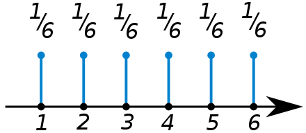

```{r setup, include=FALSE}
knitr::opts_chunk$set(collapse = FALSE)
library(tidyverse)
library(ggplot2)
library(knitr)
library(kableExtra)
library(extraDistr)
library(gridExtra)
library(latex2exp)
library(moments)
library(bookdown)
library(rsconnect)
library(tufte)
```

```{r, include=FALSE}
paygap <- read.csv('./data/gender-paygap-2019.csv')
paygap <- paygap %>%
  mutate(EmployerSize = factor(EmployerSize, levels = c('0-249','250-499','500-999','1000-4999','5000-19999','20000+')))
nycheat <- read.csv('./data/nyc-heatwave.csv')
```

\newcommand{\E}{\text{E}}
\newcommand{\Var}{\text{Var}}
\newcommand{\SD}{\text{SD}}
\newcommand{\SE}{\text{SE}}
\newcommand{\Cov}{\text{Cov}}
\newcommand{\Cor}{\text{Cor}}
\renewcommand{\P}{\text{P}}
\newcommand{\pd}[2]{\frac{\partial #1}{\partial #2}}
\newcommand{\sumin}{\sum_i^n}
\newcommand{\Bias}{\text{Bias}}

---

# Random Variables

A random variable (RV) assigns a value to the outcomes of a random process/experiment. The RV is what you are measuring in an experiment.  

E.g. if you are measuring daily rainfall, you can define $X$ as the RV for the amount of rainfall per day in millimetres (continuous RV).  

E.g. if you are measuring daily cyclist traffic, you can define $Y$ as the RV for total number of cyclists per day (discrete RV).  


\ 

---

# Probability Distributions

A probability distribution assigns probabilities to the occurrence of different outcomes.  

E.g. if $X$ is the RV for the outcome of a six-sided die toss, then the probability distribution of $X$ is:

```{r, echo=FALSE}
table1 = data.frame(cat = c('P'), 
                    `X=1` = '1/6', `X=2` = '1/6', `X=3` = '1/6', `X=4` = '1/6', `X=5` = '1/6', `X=6` = '1/6')
kable(table1, col.names = c(' ','X=1','X=2','X=3','X=4','X=5','X=6'), escape = F) %>%
  kable_styling(latex_options = "hold_position")
```


A probability distribution is defined in terms of an underlying sample space. The sample space in this case is $X = \{ 1,2,3,4,5,6 \}$

\ 

## Frequency distribution

A frequency distribution describes the observed frequency of outcomes in an experiment. E.g. if you toss a die 30 times, you can construct the following frequency table:

```{r, echo=FALSE}
table2 = data.frame(cat = c('frequency','relative frequency'), 
                    `X=1` = c('4', 0.133), `X=2` = c('7', 0.233), `X=3` = c('6', 0.2), `X=4` = c('3', 0.1), `X=5` = c('5', 0.166), `X=6` = c('5', 0.166))
kable(table2, col.names = c(' ','X=1','X=2','X=3','X=4','X=5','X=6'), escape = F) %>%
  kable_styling(latex_options = "hold_position")
```

\ 

## Probability distribution function

This describes the specific functional form of a probability distribution. There are two types:

For discrete RVs, a **probability mass function (pmf):** gives the probabilities of a discrete RV being exactly equal to a particular value. All values of the function add to 1. E.g. the pmf of a six-sided die toss:

```{r}

```


For continuous RVs, a **probability density function (pdf):** gives the relative likelihood that the value of the RV equals that value. The area under a pdf is 1. E.g. if instead of a six-sided die, you have a random number generator giving real numbers between 1 and 6, its pdf is:  

`insert image`

Note, the *absolute likelihood* that an RV equals a particular value is zero (since there is an infinite range of possibility). Thus pdfs are used to predict the probability of a RV falling within a *range* of values.  


\ 

---

# Expectation & Moments

\ 

## Expected value 

The expected value of a random variable is the weighted average of all possible outcomes/values, using probabilities as weights. This is also the **mean**. 

$$E[X] = \sum_i P_i X_i$$

where $E[\cdot]$ is the **expectation operator**.  

E.g. if $X$ is the RV for a dice throw, the expected value is:

$$E[X] = \sum_i P_i X_i = \frac 16 \cdot 1 + \frac 16 \cdot 2 + \frac 16 \cdot 3 + \frac 16 \cdot 4 + \frac 16 \cdot 5 + \frac 16 \cdot 6 = 3.5$$

Note that the expectation operator is linear:

$$E[aX] = a E[X]$$

E.g. if you multiplied values on the dice by two, the expected value of the dice throw would also multiply by two:

$$E[2X] = 2E[X] = 2 \cdot 3.5 = 7$$

\ 

## Moments

A "moment" is an expectation of a power of a random variable (more generally a function). For the RV $X$, its $n$-th moment is:

$$n \text{-th moment} = E[X^n] = \sum_i P_i X_i^n$$
E.g. the **first moment** of the RV for a dice throw:  

$$E[X] = \sum_i P_i X_i = 3.5$$
The **second moment**:

$$E[X^2] = \sum_i P_i X_i^2 = \frac 16 \cdot 1^2 + \frac 16 \cdot 2^2 + \frac 16 \cdot 3^2 + \frac 16 \cdot 4^2 + \frac 16 \cdot 5^2 + \frac 16 \cdot 6^2 = \frac{91}{6}$$

Higher order moments follow the same form.  

\ 

## Central Moments

A central moment is an expectation of a power of a random variable about its mean. For the RV $X$, its $n$-th central moment is:

$$n \text{-th central moment} = E[(X-\mu)^n]$$

E.g. the **first central moment** of $X$ is:

$$E[X-\mu]$$

To write a central moment in terms of moments, expand the brackets and recognize that $\mu = E[X]$. This aids in calculation. E.g. the first central moment can be written: 

$$E[X-\mu] = E[X] - E[X] = 0$$

The **second central moment**:

$$E[(X-\mu)^2]$$
This is an important measure of the spread of a distribution, and is also known as the **variance**.  

Expanding and rearranging:

$$
\begin{aligned}
  E[(X-\mu)^2] &= E[(X - E[X])^2] \\ 
  &= E[X^2 - 2XE[X] + E[X]^2] \\ 
  &= E[X^2] - 2E[X]E[X] + E[X]^2 \\ 
  &= E[X^2] - 2E[X]^2 + E[X]^2 \\ 
  &= E[X^2] - E[X]^2
\end{aligned}
$$

In other words, the second central moment is simply the second moment minus the first moment squared.  

The moments of a random variable provide useful information about the shape of the RV's distribution, as you shall see.  


\ 

---

# Summary Statistics of Distributions/RVs

\ 

## Mean, $\mu$

The weighted average of all possible values of the RV, using probabilities as weights.  

Calculated by taking the first moment of the RV:

$$\mu = E[X] = \sum_i P_i X_i$$

\ 

## Median

The middle value of the distribution, such that the set of values below (or above) has a probability of one half.  

For symmetric distributions, the median has the same value as the mean, e.g. 

`insert`

\ 

## Mode

The most commonly occurring value. For discrete distributions, the mode is the value with the highest probability, e.g.

`insert`

For continuous distributions, the mode is the location of the highest peak, e.g.

\ 

## Variance, $\sigma^2$

A measure of the spread of the distribution. Denoted $\sigma^2$ or $Var[\cdot]$.  

Calculated by taking the second central moment of the RV:

$$\sigma^2 = E[(X-\mu)^2] = E[X^2] - E[X]^2$$

Variance does not scale linearly:

$$Var[aX] = a^2Var[X]$$

Shifting the distribution left or right leaves the variance unchanged (since variance is a measure of spread):

$$Var[X+a] = Var[X]$$

\ 

## Standard Deviation, $\sigma$

Square root of the variance.  

$$\sigma = \sqrt{E[(X-\mu)^2]}$$

\ 

## Skewness, $\gamma_1$

A measure of the extent to which a distribution is skewed to one side.  

Defined as the third centralized moment:

$$\gamma_1 = E \bigg[ \bigg( \frac{X - \mu}{\sigma} \bigg)^3 \bigg] = \frac{E[(X-\mu)^3]}{\sigma^3}$$

or the third central moment over the standard deviation cubed.  

\ 

## Kurtosis, $\gamma_2$

A measure of the fatness of the distribution's tails. 

Defined as the fourth standardised moment:

$$\gamma_2 = E \bigg[ \bigg( \frac{X - \mu}{\sigma} \bigg)^4 \bigg] = \frac{E[(X-\mu)^4]}{\sigma^4}$$

or the fourth central moment over the standard deviation to the 4.  


\ 

---

# Common Probability Distributions (next chapter)

Probability distributions are supposed to model real life random processes. Below are some common distributions you will encounter.  

\ 

## Bernoulli 

Models random processes with the following features:

* one trial
* two outcomes (success/failure)
* fixed probability of each outcome 

Parameters:

* $p$, the probability of a success

Expected value:

$$E[X] = P(X=1) + P(X=0) = p \cdot 1 + (1-p) \cdot 0 = p$$

Variance: 

Example:

You toss a coin. If you get heads, you get 100, if you get tails, you lose 40. Let $X$ be the RV for the outcomes of this experiment. Below is the probability mass function. 

$$E[X] = \sum_i P_i X_i = P(X = heads) + P(X = tails) = 0.5 \cdot 100 + 0.5 \cdot -40 = 30$$

\ 

## Binomial

Models random processes with the following features:

* $n$ trials
* two outcomes
* fixed probability of each outcome
* independent events

Parameters:

* $n$, the number of trials
* $p$, the probability of a success

Usage:

To find the probability of getting $k$ successes out of $n$ trials. Let $X$ be the RV for the number of successes. Use the binomial formula:

$$P(X = k) = \begin{pmatrix} n \\ k\end{pmatrix} p^k (1-p)^{n-k}$$

Mean and Variance:

$$E[X] = np$$
$$Var[X] = np(1-p)$$

Example:

e.g. (in R)

the pmf. 

note if n = 1 is just a bernoulli distribution. bernoulli is special case of binomial with only one trial.  

\ 

## Poisson

Models random processes with the following features:

* an event occurs in a fixed interval $k$ times
* the rate at which events occur is fixed
* events cannot occur simultaneously
* events must occur independently

Parameters:

* $\lambda$, the average event rate (in the interval)

Usage:

Modelling the number of times an event occurs in an interval of time or space. 

Probability of events:

$$P(X = k) = \frac{e^{-\lambda} \lambda^k}{k!}$$

Example:

the pmf.  

\ 

## Uniform distribution

Has a rectangular distribution. Defined over a fixed interval, every value in the interval has the same probability.  

Notation: $\mathcal U[a,b]$, where $a$ and $b$ define the interval.  

Can be continuous or discrete. 

Pdf for continuous uniform distribution:

Pmf for discrete uniform distribution: 

every possible value in interval has same probability.  

Expected value: $\frac 12 (a+b)$. 

Variance: $\frac{1}{12} (b-a)^2$. 

Skewness: 0. 

Kurtosis: 

generate random numbers with uniform distribution. 

expected val. variance. skewness. kurtosis. R. 

\ 

## Normal distribution

The bell shaped curve. Defined by mathematical function

$$f(x|\mu, \sigma^2) = \frac{1}{\sqrt{2\pi \sigma^2}}e^{-\frac 12 (x-\mu)^2/\sigma^2}$$

Shape of bell curve defined by two parameters, $\mu$ and $\sigma^2$. 

Notation: $\mathcal N[\mu, \sigma^2]$

Expected value: $\mu$. 

Variance: $\sigma^2$. 

Skewness: 0. 

Kurtosis: 0. 

two parameters: mean and variance. describe exact functional form. symmetric around mean. 

generating random numbers in a normal distribution. 

expected val. variance. skewness. kurtosis. R. 


